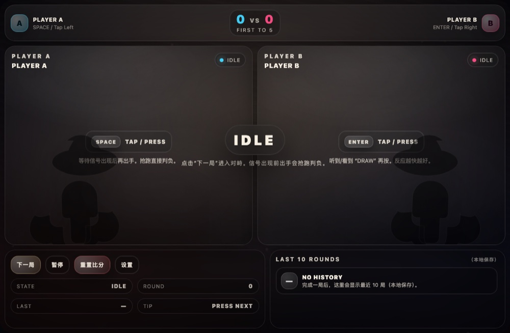

# Split-Screen Duel · Quickdraw 🔫

**▶ [Play now](https://renrenmimi.github.io/1v1/)** — runs in your browser, nothing to install.

Two players, one screen, one keyboard. Split the display down the middle and see who reacts first.
Built for phones and tablets too — pass it back and forth.

## Settings

- **Player names** for both sides
- **Target score** — first to N wins the match
- **Swap sides** — flip A and B for left/right-handed players
- **Volume** and **vibration** toggles

> The in-game UI is bilingual (English / 中文).

## Tech

Single-file HTML5 app, local two-player. No build step, no dependencies.
